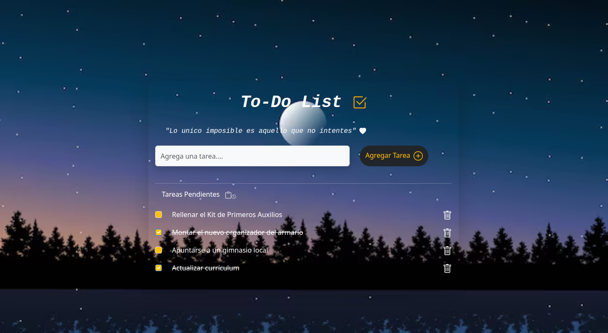

# To Do hecho con DOM .

En este proyecto realicé un To Do para registrar tareas pendientes hechas con el DOM, HTML, CSS y JS ;
Es la primera vez realizando un proyecto integrando HTML, CSS, y JS juntos y es muy emocionante para mí ver los resultados y todo lo que se puede hacer con la programación gracias a la oportunidad que me está dando Mango Chango Academy. Estoy amando la programación. Seguiré esforzándome y aprendiendo cada día más para ser una buena programadora.

